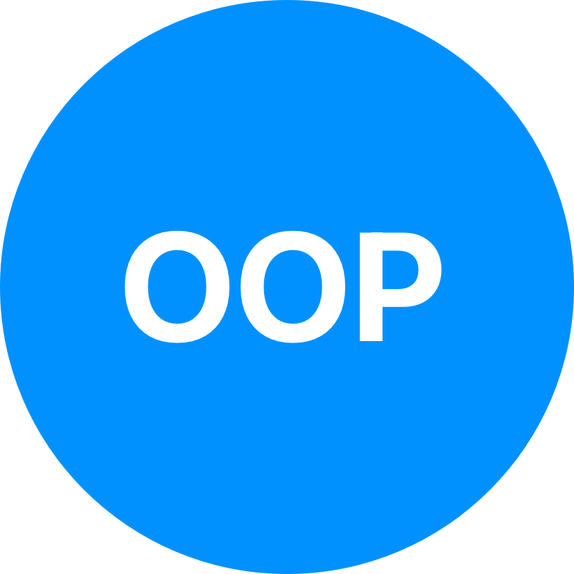
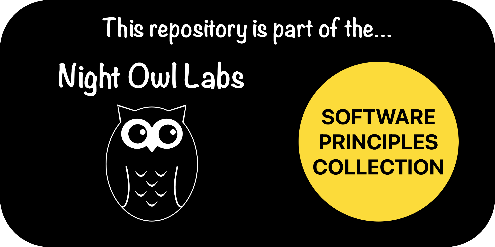

<!-- Begin README -->

<div align="center">
    <a href="https://github.com/Night-Owl-Labs/OOP-Principles" target="_blank">
        
    </a>
</div>
<br>
<p align="center">
    <a href="https://github.com/Night-Owl-Labs"></a>
    <a href="https://x.com/reciperesizer"></a>
    <a href="mailto:support@nightowllabs.io"></a>
    <br>
    <a href="https://prgportfolio.com" target="_blank"></a>
</p>

---------------

<h1 align="center">Object-Oriented Programming (OOP) Principles</h1>

<div align="center">
    <a href="https://github.com/Night-Owl-Labs/Software-Principles-Collection" target="_blank">
        
    </a>
</div>

**Object-Oriented Programming (OOP)** is a programming paradigm that focuses on objects and data rather than functions and logic. It is based on the concept of objects that contain data and methods that operate on that data. OOP allows us to break down complex problems into smaller, more manageable chunks

---------------

## Table of Contents

- [Introduction](#introduction)
- [Four Principles of OOP](#four-principles-of-oop)
    - [1. Encapsulation](#1-encapsulation)
    - [2. Abstraction](#2-abstraction)
    - [3. Inheritance](#3-inheritance)
    - [4. Polymorphism](#4-polymorphism)
- [Conclusion](#conclusion)
- [Resources](#resources)
- [License](#license)
- [Credits](#credits)

## Introduction

This repository provides a brief explanation of the four main principles of **Object-Oriented Programming (OOP)** along with corresponding code examples.<br>

> [!NOTE]
> The code examples are written in Java, but the principles can be applied to any object-oriented programming language.

## Four Principles of OOP

The four main principles of OOP are encapsulation, abstraction, inheritance, and polymorphism. Let's take a closer look at each of them.

### 1. Encapsulation

Encapsulation is the practice of bundling data and methods that operate on that data within a single unit (object). It helps protect the object's internal state from direct manipulation and enforces controlled access through well-defined methods.

Example in Java:

```java
class BankAccount {
    private double balance;

    // Getter method to access the balance (read-only)
    public double getBalance() {
        return balance;
    }

    // Setter method to update the balance (write-only)
    public void setBalance(double newBalance) {
        if (newBalance >= 0) {
            balance = newBalance;
        }
    }

    // Method to deposit money into the account
    public void deposit(double amount) {
        if (amount > 0) {
            balance += amount;
        }
    }

    // Method to withdraw money from the account
    public void withdraw(double amount) {
        if (amount > 0 && amount <= balance) {
            balance -= amount;
        }
    }
}
```

In this example, the `balance` data member is encapsulated within the `BankAccount` class. External code cannot directly modify the `balance`, but it can interact with the account through the `deposit` and `withdraw` methods, which ensure controlled access to the balance.

### 2. Abstraction

Abstraction involves simplifying complex reality by creating classes that represent essential characteristics and behaviors while hiding unnecessary details.

Example in Java:

```java
abstract class Shape {
    abstract double calculateArea();
}

class Circle extends Shape {
    private double radius;

    public Circle(double radius) {
        this.radius = radius;
    }

    @Override
    double calculateArea() {
        return Math.PI * radius * radius;
    }
}

class Rectangle extends Shape {
    private double length;
    private double width;

    public Rectangle(double length, double width) {
        this.length = length;
        this.width = width;
    }

    @Override
    double calculateArea() {
        return length * width;
    }
}
```

Here, the `Shape` class is an abstract class that defines the concept of a shape with an abstract method `calculateArea()`. The `Circle` and `Rectangle` classes are concrete subclasses that extend `Shape` and provide their implementations for the `calculateArea()` method. The details of the shape's type (circle or rectangle) are abstracted away, and we can work with shapes in a more generalized manner.

### 3. Inheritance

Inheritance allows a class (subclass) to inherit properties and behaviors from another class (superclass). It promotes code reuse and supports the "is-a" relationship.

Example in Java:

```java
class Animal {
    void makeSound() {
        System.out.println("Animal makes a sound");
    }
}

class Dog extends Animal {
    @Override
    void makeSound() {
        System.out.println("Dog barks");
    }
}

class Cat extends Animal {
    @Override
    void makeSound() {
        System.out.println("Cat meows");
    }
}
```

In this example, the `Animal` class serves as the superclass, and `Dog` and `Cat` are subclasses. They inherit the `makeSound()` method from the `Animal` class, but each subclass provides its implementation, representing the "is-a" relationship between animals and specific types of animals.

### 4. Polymorphism

Polymorphism allows objects to take on multiple forms or methods to have multiple implementations. It enables a unified interface for different classes.

Example in Java:

```java
class Printer {
    void print(String content) {
        System.out.println("Printing: " + content);
    }
}

class LaserPrinter extends Printer {
    @Override
    void print(String content) {
        System.out.println("Laser printing: " + content);
    }
}

class InkjetPrinter extends Printer {
    @Override
    void print(String content) {
        System.out.println("Inkjet printing: " + content);
    }
}
```

In this example, the `Printer` class has a `print()` method, and both `LaserPrinter` and `InkjetPrinter` are subclasses of `Printer`. Depending on the object type, the appropriate implementation of the `print()` method is invoked at runtime, achieving polymorphic behavior.

## Conclusion

Understanding and applying these four principles of Object-Oriented Programming in Java can lead to more organized, reusable, and maintainable code. Feel free to explore the provided examples and experiment further with OOP concepts. Happy coding!

## Resources

- [Object-Oriented Programming (OOP) Concepts in Java](https://www.geeksforgeeks.org/object-oriented-programming-oops-concept-in-java/)
- [OOP Concepts in Java](https://www.javatpoint.com/java-oops-concepts)

## License

This project is released under the terms of the **MIT License**, which permits use, modification, and distribution of the code, subject to the conditions outlined in the license.
- The [MIT License](https://choosealicense.com/licenses/mit/) provides certain freedoms while preserving rights of attribution to the original creators.
- For more details, see the [LICENSE](LICENSE) file in this repository. in this repository.

## Credits

**Author:** [Night Owl Labs, LLC.](https://github.com/night-owl-labs) <br>
**Email:** [support@nightowllabs.io](mailto:support@nightowllabs.io) <br>
**Website:** [nightowllabs.io](https://www.nightowllabs.io) <br>
**Reference:** [Main Branch](https://github.com/Night-Owl-Labs/OOP-Principles) <br>

---------------

<div align="center">
    <a href="https://nightowllabs.io" target="_blank">
        
    </a>
</div>

<!-- End README -->
